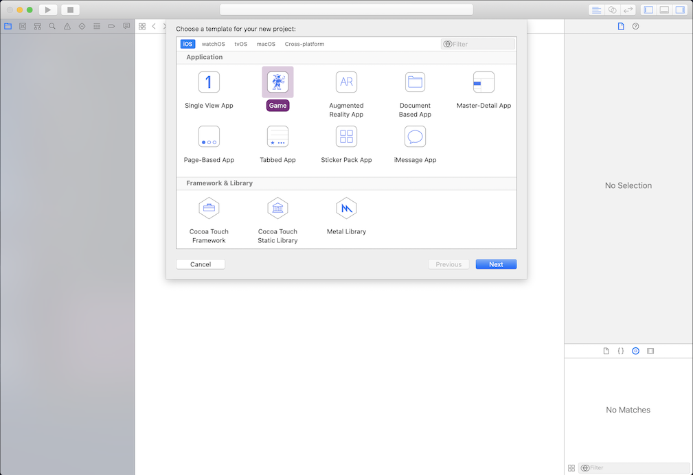
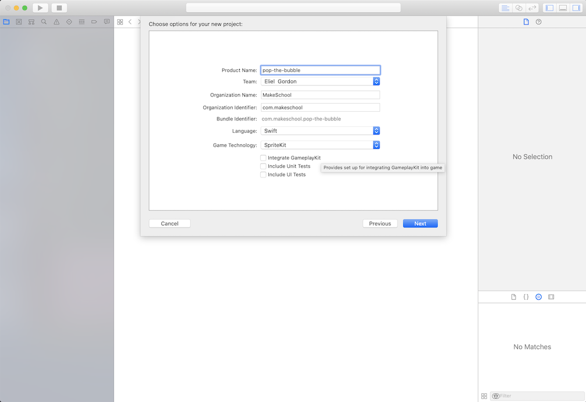
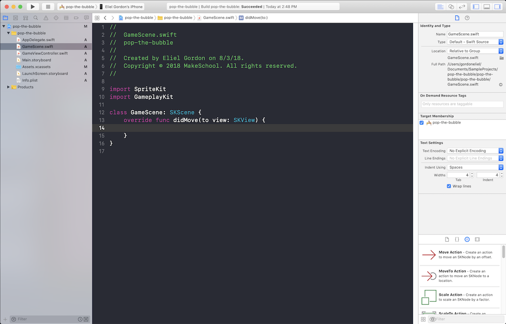

# Pop The Bubble

Pop the bubble game

## Baseline Challenges
Complete the following Phases of the `Pop The Bubble` iOS Game.

### Phase 1 - Setup Scene

1. Create An Xcode Game Project.

  | Step 1: New Game | Step 2: Project Name |
  | :------------- | :------------- |
  |  |  |

2. Remove all the .sks files

  

3. Replace the contents of `viewDidLoad` in `GameViewController.swift` to setup the GameScene for presentation

  

4. Remove boilerplate code from the `GameScene.swift` file

  

---

### Phase 2 - Create Bubbles

1. Write a function that generates randomly colored bubbles

---

### Phase 2 - Generate Random Bubbles

1. Setup a timer to generate a random bubble to add to the scene every (x) seconds

---

### Phase 3 - Bubble Interactions

1. Create a variable to hold Points
1. Handle touch events when user taps a Bubble
1. Increment number of points when user taps a Bubble
1. Remove Bubble from scene when tapped

---

### Phase 4 - Game Over Scene

1. Create a scene to handle when the game is over
1. Create a label to render whether a game was won or lost
